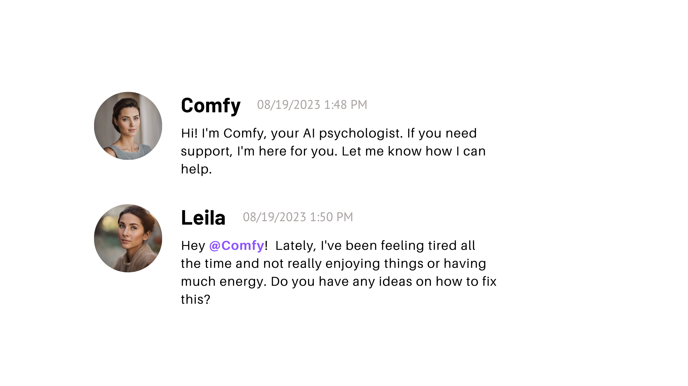

# Comfy

<div align="center">
  
</div>

**Comfy** is an AI-powered psychologist-Discord bot.

## How can I add Comfy to my Discord server?

To run Comfy, you'll need to:
- [install poetry](https://python-poetry.org/docs/#installation)
- [create a Discord bot account](https://discordpy.readthedocs.io/en/stable/discord.html) and obtain the Discord bot token
- [obtain the id of the Discord server](https://support.discord.com/hc/en-us/articles/206346498-Where-can-I-find-my-User-Server-Message-ID-) that you want to add the bot to

After you have done this:
1. Copy `.env.example` to `.env`.
2. Enter your Discord bot token, and Discord server id into `.env`. The bot will only function within this server.
3. In the terminal, navigate to the project dir and run:
```sh
poetry install
poetry poetry run python comfy/app.py
```

## License

MIT
